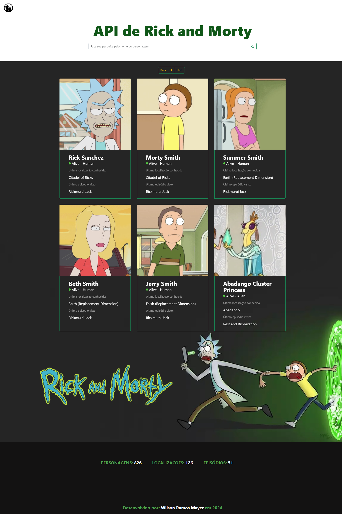

<h1 align="center">
     API do Rick and Morty
</h1>

---

## 🕵Sobre

Aplicação com o objetivo de consumir a API do Rick and Morty e exibir os cards de cada personagem com suas informações báscias.

---

## 🧑‍🦰Quem Faz

- WILSON RAMOS MAYER

---

## 🔠Conteúdos

<!--ts-->

- [Sobre](#sobre)
- [Quem Faz](#-quem-faz)
- [Status](#status)
- [Objetivo do Projeto](#objetivo-do-projeto)
- [Requisitos de Funcionalidade](#requisitos-de-funcionalidade)
- [Concepção do Projeto](#concepcao-do-projeto)
- [Rodando o Projeto](#rodando-o-projeto)
- [Sobre a Licença](#sobre-a-licença)
<!--te-->

---

## 🧭Status do Projeto

- ⌛ Feito

---

## 🎯Objetivo do Projeto

Este é um projeto de Front-End, desenvolvido no Programa de Formação Full Stack Web Developer da Growdev, cujo o principal objetivo foi estudar e compreender o uso de APIs REST.

## ☑️Requisitos de Funcionalidade

- [x] Exibição de todos os persogans da série na tela inicial
- [x] Cada card abre as informações específicas de cada personagem
- [x] Barra de input habilitada para pesquisa por personagem

---

## 💡Concepção do Projeto.

---

## 🛰Rodando o Projeto

Para Rodar o projeto, siga as seguintes etapas :

- CLONAR O REPOSITÓRIO
- INSTALAR AS DEPENDÊNCIAS DO AXIOS
- EXECUTAR NO NAVEGADOR O ARQUIVO INDEX.HTML

---

## 📝Sobre a Licença

Este projeto esta sobe a licença [MIT](./LICENSE).
